文字本应该在比赛当天就记下的，但比完之后又忙着处理很多事情，等到现在才算有时间能好好写点什么了。打完比赛那天仿佛有很多话语，但现在写下这段话时又不知从何处说起。那就先尽力复盘一下应该算是我大学生涯中的最后一场ACM比赛——JSCPC2022的全程。

比赛是在周六举行的，周五晚上照例是打了场热身赛，在赛前我就和队友说今天打差点没关系，人品运气就会留到明天。比赛时队友速A了签到题，我开了另一题，结果由于一个地方没注意就WA了一发，随后马上被队长指出来才过掉。这之后大家都不想打了，于是两题打卡下班。看了一眼排名，不算很好，在同校的几个队伍中排倒数。不过可能是我赛前的话，加上之前几场比赛的经历，我们队都没太在意这个热身赛，还是讨论好怎么打好明天的正式赛。

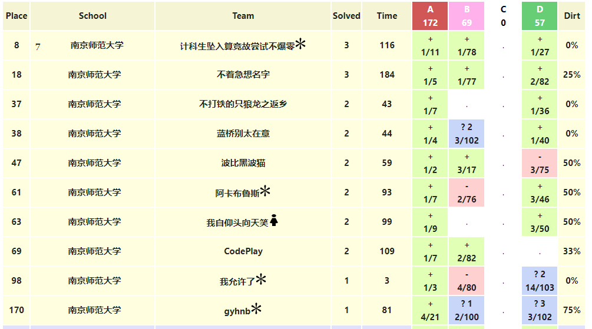

第二天比赛前因为昨晚睡得比较好，所以我去考场时心情本身就比较轻松，考前一小时正好踩点到，然后就是照常测试比赛用机，一切都算顺利。唯一让人有点慌的就是考前半小时是队长突然不见了， 然后还没登录考试系统，最后五分钟才出现。算迟到几分钟才进入比赛开始答题，不过毕竟要打五个小时，所以这几分钟也影响不大。

正式开打时，我们是三个人先随机找签到题，没几分钟队友就说A题可签，于是三个人就一看了。题目叫PENTA KILL，就是对输入的玩家击杀序列进行五杀判定，我以为这个判定与现实中的规则应该是一样的，就顺着常识打了出来，给队友看并测了几个样例感觉都没错就交了，没想到居然WA了，心态就有点崩，一时不知道是哪里出了问题。后来队长就说他这个五杀是如果A把B杀了，但C又把B杀了，那么这个B的击杀是不影响先前的击杀的，只有C再把B击杀时才算重新来一轮。我当时感觉这很扯，但队长就刷刷地把代码改出来了想交，我就在一旁说那行你交好了，其实心里想看着他WA掉，没想到他交完就AC了，我瞬间被打脸hhhhh。

比赛中期算是我们队的一个爆发期，I题和K题很顺利地推出了结论，一发就过了。然后就是另一道有点坑的C题，也就是让我们银首队遗憾失金的一题。当时是我搞出了O(n^2)的一种DP解法，不过肯定会超时，然后我的两个队友就说是用单调队列优化一下，我就交给他们去搞了，然后自己在一旁构造一些样例。这里确实是当时运气比较好，正好构造出了一个智慧样例，等队友的代码打完后来试构造的样例时，发现这里是需要讨论的，也就是在最后一步时还需不需要满足X-Level的倍数，还是考虑只要小于P的任意步就好了。我们最后再看了一眼题，三人一致偏向后者，想着先这么交一发，错了就换另一种交。队长就这么点了提交，嘿嘿，居然又一下子就过了！那时看了一眼榜，打开排二十几，当时就想这很有机会银，队友也情不自禁的笑了起来，不过队长还是冷静地劝我俩再打一道，四题银还是很悬，于是就继续看下面的题了。接下来我对L题有想法，队友在想J题，不过最后因为双开，所以一人调试时没有太多时间，老想着给另一边打，加上大家可能都有点累了，状态下滑，所以最后没能做出一题。封榜时好像是排25名，当时还是比较忐忑的，怕后面的几个队都A出来了挤掉我们。不过至少是有牌子了的。

**最终终榜出来后一看，32名，4题首，银牌到手**！另外一个队是5题银首+两道首A，一个队是铜。三个队都是每周去格物楼317一起打训练赛的，总体是比去年要进步的。

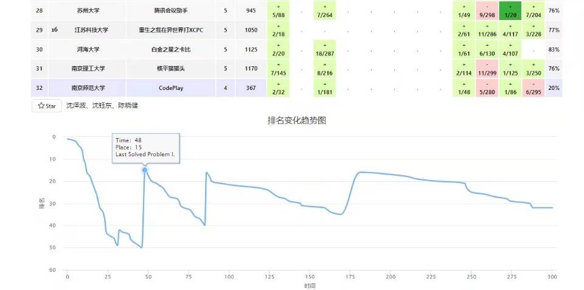

接着大家就互相庆祝然后合照。当然，最令我激动和开心的是打完比赛后没想到未见已久的叶学长回来了！也就是去年的大概这个时候在打上海站后，学长见到了之前与他打比赛的田学长和刘学长也超级激动，我那刻的心情便如一年前的学长那般，甚至更加开心。和学长拍了最后的合照（学长保完研就去实习再也没见过他，一直以为再也无法与学长一起拍张照了呢）也算圆了我这近一年的心愿。

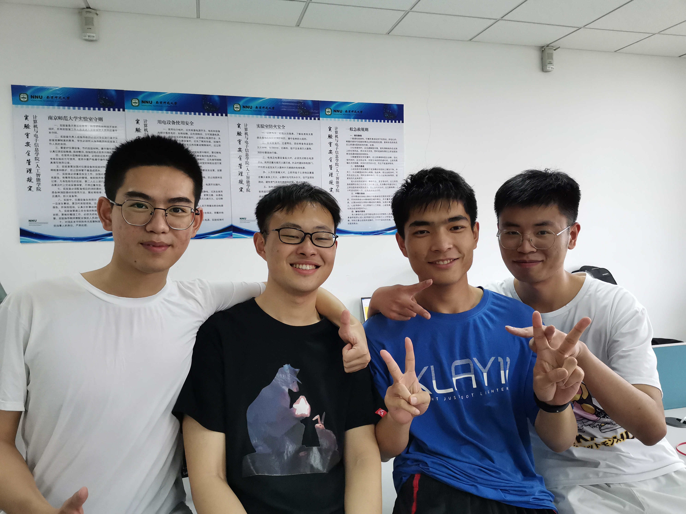

之后大伙几个一起吃了饭，替学长拍了毕业照，欢送了学长后又玩了一会儿谁是卧底，那天仿佛回到了20年暑假，在疫情封校时期下最简单的快乐。

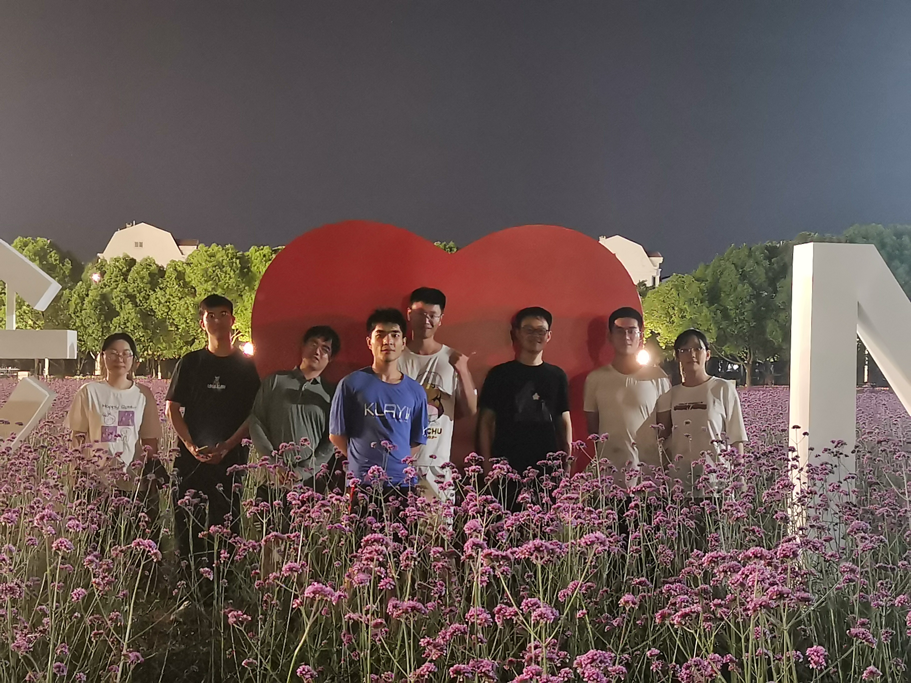

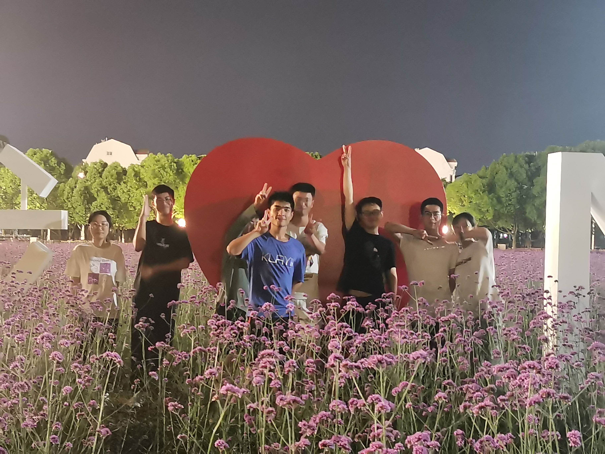

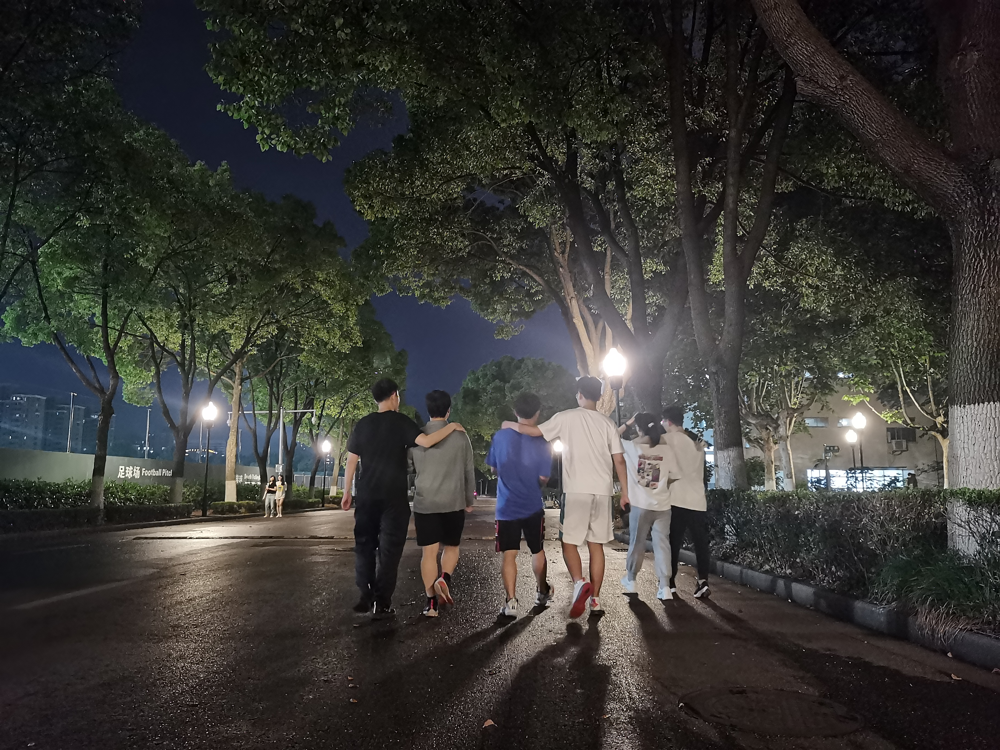

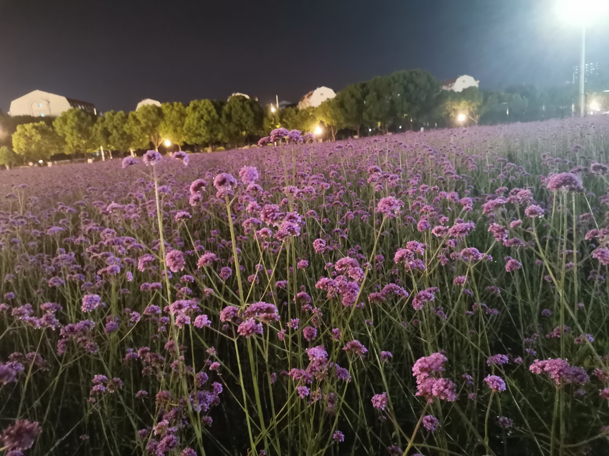

## *写在最后：*

回望算法竞赛的三年，恰好也是疫情的三年。许多枯燥的日子在时间的冲刷下早已被淡忘，但那些璀璨而珍贵的日子却如美酒般愈发浓厚。我至今仍记得，那年暑假留校在314里学长留给我专注的背影，与羽毛球上各种发球的诡异；那天夜里在学行楼6楼廉神亲手教我和沈哥如何刷OJ，当时讲的前缀和与差分我之后时常用起；那些午后在317学弟给我们构造的智慧样例，还有沈哥说拿银就倒立洗头的吹逼......也许若干年后在夜深人静，这回忆的点滴便又萦绕于我的梦里，支撑着我继续前进。

单从三次JSCPC上来看，我是幸运的，从打铁到惊险的铜牌，再到这次比较稳的银牌，一次比一次有了进步。但这进步的背后，是有学新算法的困惑；有屡次ICPC碰壁打铁的沮丧；有最后一次蓝桥杯失利的自我怀疑与一度对算法丧失信心，但又在每周到317去和队友日复一日的训练。顾老师曾说，每个人的成功是不可复制的，但失败的方式却大同小异。因此先前我总是想少些优秀学子分享会，而多开一些失败总结会，我们应该多去从失败中找到原因，这样才能对我们今后的发展真正有用。但当我现在回过头来看这三年的ACM经历，当我有机会能再和从前在失败中不停反思懊恼的自己对话时，也许只剩一句“The answer, my friend, is blowing in the wind”。这也是为什么叶学长那天仍谈起顾老师上课时说的**Take it easy and enjoy the life**，生活不是趋向**所谓**的成功，也不是总结**所谓**的失败，而是活在当下，感受生活本身的风吹草动带来的内心的喜悦，与平静。

我是一个很害怕孤独的人，所以很幸运在我打ACM竞赛的道路上，能遇到很多志同道合的伙伴。这里面有与我一起打过比赛的**沈哥，沈学弟，蔡学长，彭学弟**；也有平日里与我交流算法心得，同我分享倾诉的**廉神，王学长，钱学长，涛哥**；当然，还有对我在ACM道路上有着启蒙意义的**叶学长**，作为上任算法赛队的社长，学长在我刚进大学时向我介绍什么是ACM领我进入算法赛队，之后我跟着学长有幸当了赛队的副社长，也帮忙和学长一起出过赛题，在我心中，叶学长一直都是我学习和追赶的榜样，他有如一个明星，指引着我在黑夜里用黑色的眼睛去寻找光明。我也一直在潜意识中去模仿和追赶学长的脚步，从算法队里一起训练到课题组里赶VIS论文的通宵之夜，从努力拉满绩点综测到甚至很巧地都在大三上这个时间点开始一段恋情（虽然我没能坚持下去hhh）。我觉得我从起先仰望学长而不敢提问怕被嘲笑的状态，至少逐渐是有更多的交流了。我的技能点虽然可能横向上还没学长丰满，但确实是在纵向上有了巨大的提升，这些影响是如皎月般明亮，但又如浮云一般无形，接触越多时，便越有了云中翻月的启迪。

叶学长在写他的最后一届ACM比赛总结时，写道：“随着时间的推移，记忆中的场景慢慢的拉成一条线，线上只有一瞬。“记忆或许随着时间的流逝变得不再清晰，但美好却在岁月的洗涤中显得愈发珍贵。我想，这些记忆的线会为生活过的相框嵌上一层金色的镶边，历久而弥坚。

>*（全文完）*

*附一些一直以来存在手机里的比赛照片：*

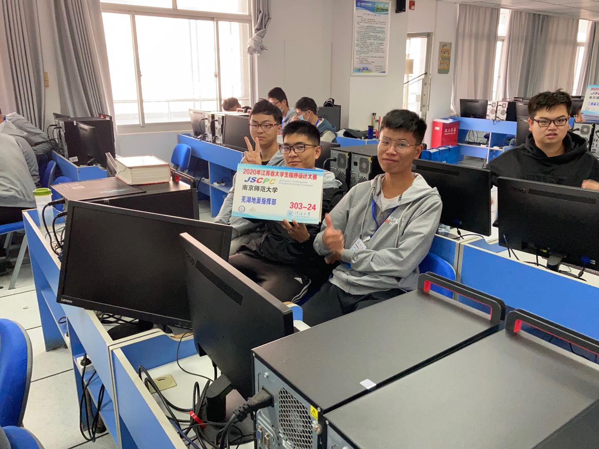

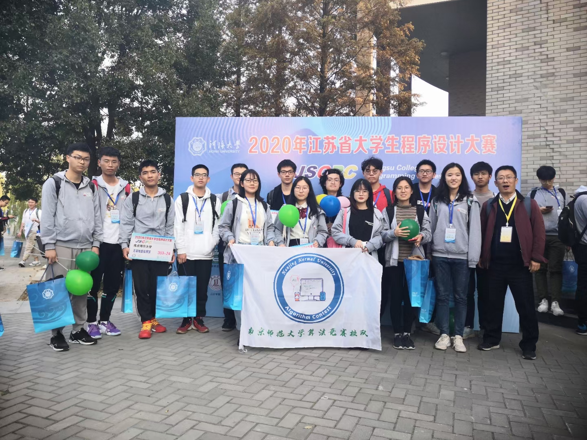

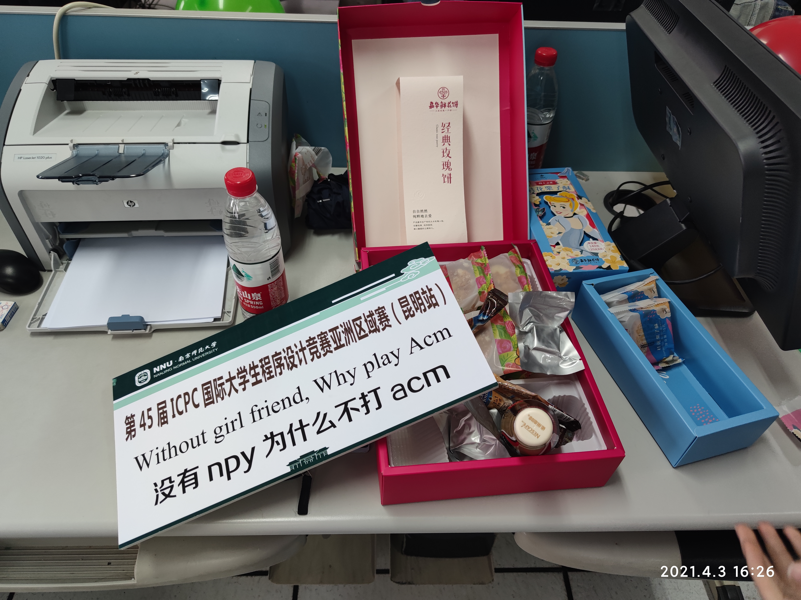

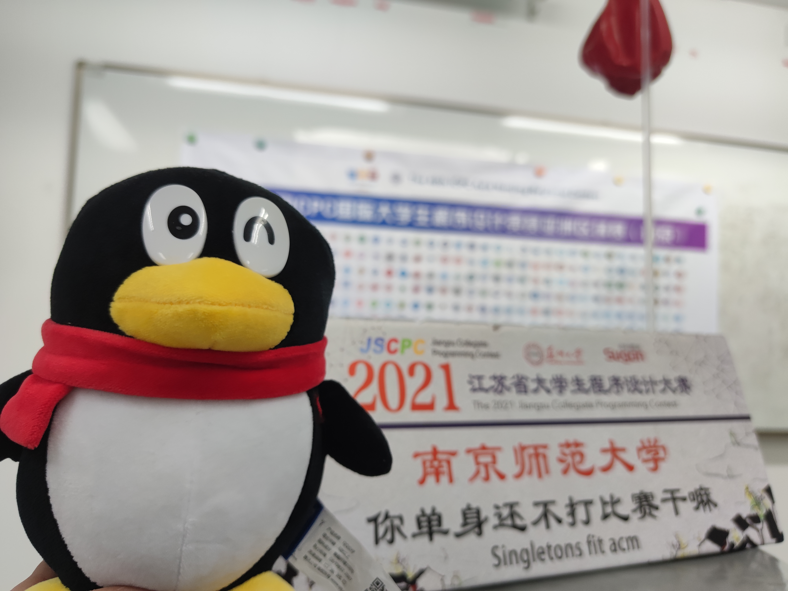

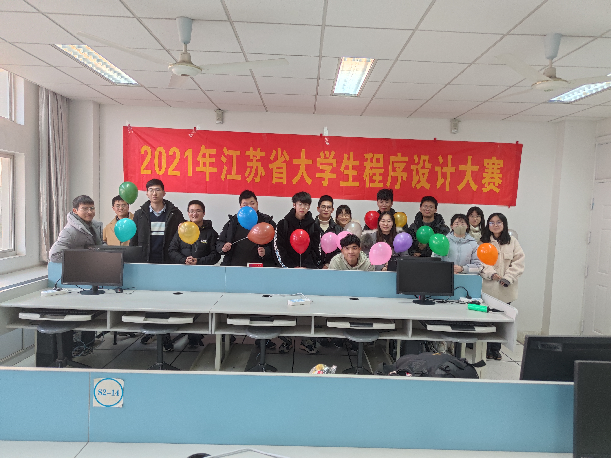

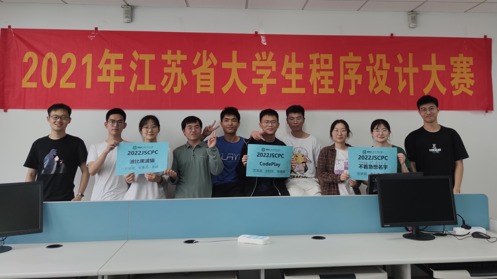

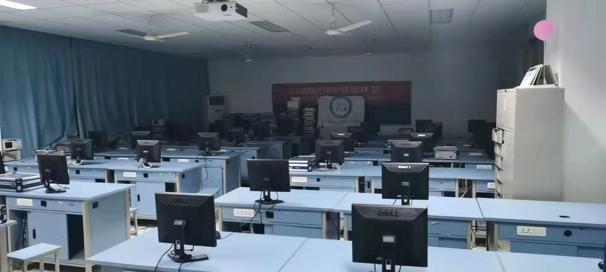

